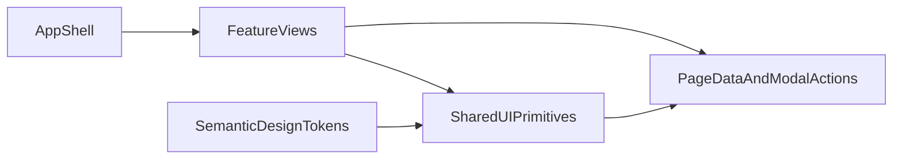

# UI Modernization Research for HabiHamAIUi

## 1) Current UI Baseline

### Tech stack (actual)
- Framework: React 18 + Vite + React Router.
- Dependencies are minimal in `package.json`: only `react`, `react-dom`, `react-router-dom`.
- No dedicated libraries for UI kit, forms, table engine, state management, charts, i18n, or animation.

### Architecture reality
- Main UI logic is concentrated in `src/App.jsx` (routing + state + API calls + all tab UIs + many modals).
- Reusable UI is very limited (`src/TopNav.jsx` is one explicit reusable component).
- Styling is centralized in `src/styles.css` with CSS variables and global class-based styling.

### UX pattern status
- Existing behavior mostly follows the workspace rule: data is shown on pages, actions are often done in modals.
- This is visible in `profile`, `workouts`, and `admin` sections.
- Modal accessibility is partially implemented (some dialogs have `role="dialog"` and `aria-modal`, but not fully unified behavior).

### Main constraints
- `App.jsx` monolith increases regression risk and slows visual refactoring.
- No common UI primitives layer (`Button`, `Modal`, `Input`, `Table`, etc.) as a system.
- Token layer exists, but not yet structured into semantic design tokens and component styles.
- Mixed language labels (RU/EN) make design consistency harder.

## 2) Modern UI Options (2-3 realistic paths)

## Option A: Headless + custom design
**Stack**: Radix UI primitives + Tailwind CSS + shadcn/ui-style component ownership.

**Pros**
- Maximum visual flexibility and strong long-term design-system control.
- Good accessibility baseline through headless primitives.
- Components live in project code, easier to evolve under product-specific UX.

**Cons**
- Larger initial setup and design decisions.
- Requires team discipline in tokens, variants, and component governance.
- Migration takes longer than ready-made kits if many screens must change quickly.

**Fit for this project**
- Best if you want a unique product look and gradual design-system maturity.

## Option B: Enterprise component kit
**Stack**: MUI (preferred) or Ant Design.

**Pros**
- Fastest way to replace ad-hoc controls with complete, tested components.
- Strong ecosystem for tables/forms/dialogs, better short-term velocity.
- Predictable behavior for complex CRUD screens.

**Cons**
- Harder to achieve unique brand look without deeper theming effort.
- Potential larger bundle and stronger design language lock-in.
- Some components may feel generic unless customized.

**Fit for this project**
- Best if near-term goal is speed, consistency, and reducing UI maintenance cost quickly.

## Option C: Soft evolution on current CSS
**Stack**: Keep current approach, add semantic tokens + internal UI primitives (no large UI library).

**Pros**
- Lowest migration risk and minimal dependency changes.
- Keeps existing look and behavior with gradual cleanup.
- Good bridge phase before choosing a full library.

**Cons**
- Slower path to modern component ergonomics.
- More internal maintenance burden.
- Accessibility/composability improvements depend on custom implementation quality.

**Fit for this project**
- Good as transition phase, not ideal as final state for long-term scale.

## 3) Comparative Decision Matrix

- **Fastest delivery**: Option B (MUI/AntD)
- **Best long-term custom design**: Option A (Radix + Tailwind + owned components)
- **Lowest immediate risk**: Option C (internal primitives on existing CSS)
- **Best balance for HabiHamAIUi**: start with Option C foundations, then move to Option A.

## 4) Recommended Target Stack

Primary recommendation:
- **Core UI strategy**: Option A target (headless + owned components).
- **Practical sequence**: Option C as phase-1 stabilization, then phased move to Option A.

Concrete library set for migration:
- UI primitives/accessibility: `@radix-ui/*` (Dialog, DropdownMenu, Tabs, etc.).
- Styling/tokens: Tailwind CSS + CSS variables for semantic tokens.
- Component scaffolding: shadcn/ui approach (project-owned components).
- Forms: `react-hook-form` + `zod`.
- Table engine: `@tanstack/react-table`.

Reasoning:
- Keeps flexibility for product-specific UX while improving accessibility and consistency.
- Reduces monolith risk via shared UI layer before broad redesign.
- Matches existing CRUD-heavy tabs (`workouts`, `admin`) where modal/form/table quality matters most.

## 5) Safe Migration Roadmap (3 iterations)

### Iteration 1 - UI foundation (low risk, no major behavior changes)
- Create `src/shared/ui` with base primitives: `Button`, `Input`, `Select`, `Textarea`, `Card`, `ModalShell`, `TableWrap`.
- Create `src/shared/styles` with:
  - `tokens.css` (semantic color/spacing/radius/typography),
  - `base.css`,
  - `components.css`.
- Unify modal behavior:
  - overlay click close policy,
  - Escape close,
  - focus entry/return,
  - consistent ARIA labeling.
- Keep existing business logic in `App.jsx` unchanged.

**Exit criteria**
- Visual parity for existing controls.
- At least 3-5 current modal usages moved to `ModalShell`.
- No functional regressions in login/workouts/admin basic flows.

### Iteration 2 - Feature extraction for key tabs
- Split `App.jsx` view sections into feature components:
  - `src/features/workouts/*`
  - `src/features/admin/*`
- Replace repeated controls with shared primitives.
- Introduce `react-hook-form + zod` for key admin/workout forms.
- Introduce `@tanstack/react-table` for users/program tables where it adds value.

**Exit criteria**
- `workouts` and `admin` are mostly feature-isolated.
- Duplicate form/table markup is reduced.
- Modals in these tabs use one shared modal contract.

### Iteration 3 - Full UI consolidation
- Extract remaining sections (`ai`, `profile`) into `src/features/ai` and `src/features/profile`.
- Standardize typography/spacing/color usage to semantic tokens.
- Normalize micro-interactions and responsive behavior.
- Prepare optional i18n layer for RU/EN consistency.

**Exit criteria**
- `App.jsx` becomes orchestration shell instead of full UI monolith.
- Shared UI primitives are the default path for all new views.
- Consistent design language across all tabs.

## 6) Suggested Folder Structure

```text
src/
  app/
    AppShell.jsx
    routes.jsx
  shared/
    ui/
      button.jsx
      input.jsx
      modal-shell.jsx
      table-wrap.jsx
    styles/
      tokens.css
      base.css
      components.css
  features/
    workouts/
      ui/
      model/
    admin/
      ui/
      model/
    ai/
      ui/
      model/
    profile/
      ui/
      model/
```

## 7) Architecture Flow (target)



## 8) Risks and Mitigation

- Risk: regression from monolith extraction.
  - Mitigation: separate presentation first, keep API/state contracts stable in early phase.
- Risk: inconsistent modal behavior during transition.
  - Mitigation: enforce one `ModalShell` and migrate modal-by-modal with checklist.
- Risk: mixed visual language while old/new components coexist.
  - Mitigation: token-first approach and clear rule that new UI must use shared primitives.

## 9) Final Recommendation

- Use a **two-step strategy**:
  1. Stabilize and standardize UI foundations inside the current app (tokens + shared primitives + unified modal a11y).
  2. Move to headless, project-owned component architecture (Radix + Tailwind + shadcn/ui pattern) while extracting features from `App.jsx`.
- Start migration with `workouts` and `admin` because they deliver the highest impact in forms/tables/modals with manageable risk.
